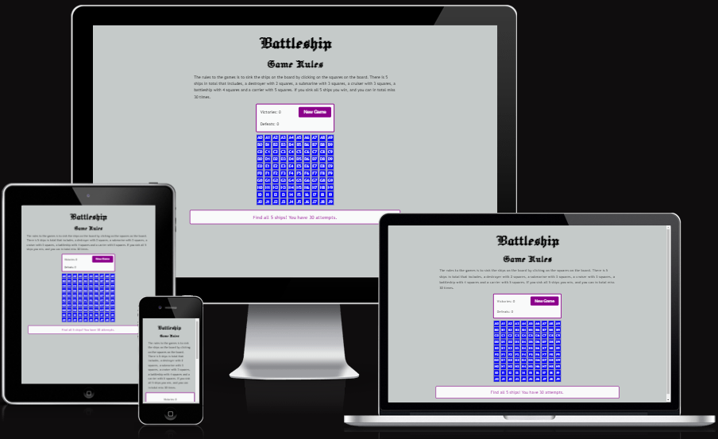

# Battleship

Different Coloured Tea is a website to spread awareness to tea drinkers that only had black tea or black and green tea.
The visitor will find out that there is other tea than black and green tea also red (rooibos), white, yellow, blue and purple tea, I will also mention Oolong tea that is often a bit grayish brown with a hint of yellow often called in between black and green, the site does not plan to mention for example the huge quantity of tea from each colour or herbal tea, it will also include pictures of the different colours.

# UX
### Visitor Goals
The expected visitor is:
- Visitors that like tea and want to broaden their horizon.
- Visitors that are curious what is out there in the world of tea.
- Visitors that wants to know more and therefore will contact us.

Visitors goals are:
- See pictures and information about colourful tea and get inspired.
- To see what exists in the world of tea.
- Contact the people behind the website.

How Different Coloured Tea fills the needs:
- You can see the coloured tea on the pictures right at the landing page and also on the Contact Form.
- About Tea has some short information about the different coloured tea.
- The Contact Us page makes it possible to contact us.
- Easy to reach everything form the header and you can find our social media in the footer, you also see the footer all the time.

### Business Goals
The Business Goals are:
- Spread awareness of the more uncommon tea colours.
- Get in touch with other tea drinkers that are not satisfied with your normal tea.
- If enough people will be aware the bigger chance that you will find the more rare tea in your city.

### User Stories
1. As a curious tea drinker I expect to find out about different kind of tea.
0. I expect to get in touch with other people with my interest in more rare tea colours.
0. I expect to be able to have a reference so I can spread awareness myself

### Existing Features

- __Header__
  - Header has a menu with a nav bar or text on bigger screens and the website name in h1.

- __Navigation Bar__

  - The navigation bar can be found on all 3 pages and is fully responsive, it will turn between a bar or buttons depending on the size of the screen.
  - The bar will be visible even if you scroll down. 

- __The landing page images__

  - The landing page or "Home" has 8 different coloured tea on it, with 1-2 pictures in a row depending on screen size and it is fully responsive in image size also. 
  - This page will make the visitor see all kind of colours on tea that they might not know that it existed.

- __About Tea__

  - About Tea page will give a short description of the different coloured tea. 
  - I have put different coloured background behind every div related to a specific tea colour, it should be the same main colour as the tea but with a more friendly palette. 

- __Contact Us__

  - The Contact Us page has a contact form and a background picture that is fully responsive. 
  - The form has a background with an opacity to make it see through while still making the text easy to read. 

- __The Footer__ 

  - The footer can always be seen and has logos with links to Facebook, YouTube, Instagram and X. 
  - The footer is both responsive and all the links works.

### Features Left to Implement

- I wanted to make an event information, also to get links from every picture on Home to the correct line in About Tea, make buttons change colour when marked, creating a couple of icons and maybe something more that I haven't thought about.

## Testing 

I have tested all links and buttons including navbar and they all work, the form also work and requires an email in email field, one of the radio buttons and the name fields filled in, but checkbox is optional.
I have tested on Chrome, Firefox and Edge without a problem, checked on many different sized from about 280p to 2000 px wide and 400px to about 2000 px high and didn't find any problems with the responsiveness.

### Validator Testing 

- HTML
  - No errors were returned when passing through the official [W3C validator](https://validator.w3.org/nu/?showsource=yes&doc=https%3A%2F%2Falexanderaberg.github.io%2FDifferent-Coloured-Tea%2Findex.html) Also checked About Tea and Contact Us pages without any errors.
- CSS
  - No errors were found when passing through the official [(Jigsaw) validator](https://jigsaw.w3.org/css-validator/validator?uri=https%3A%2F%2Falexanderaberg.github.io%2FDifferent-Coloured-Tea%2Findex.html&profile=css3svg&usermedium=all&warning=1&vextwarning=&lang=sv) it got validated as CSS Stage 3 +SVG!

### Unfixed and fixed Bugs

- Solved all known bugs, except for the blue background behind the submit button in the form on the Contact Us page on phones (tested on iPhone 13 Pro), it looks correct in Google Dev Tools.
- I Had some issues with fixing the header and did it with the help of a tutor same thing with photos on larger screens which you can see in the css.
- I did much trial and error with forms, pictures, header and footer and went through many colours on About Tea until my mentor suggested that I use the tea colour as background which made it possible to have text and background fit together better, I also did choose black as background for menu bar and contact form, the contact form I still wanted to see the background through which I sorted with the help of opacity.
- I also got some help from my slack team for the header.

- I would say that the header is by far what I had biggest problems with and the responsivness on larger screens for images on home.

### Quality Score through Google Devtools Lighthouse

- Lighthouse testing on Chrome Incognito to prevent cookies and background cache to slow down.

## Deployment

- The site was deployed to GitHub pages. The steps to deploy are as follows: 
  - In the GitHub repository, navigate to the Settings tab 
  - From the source section drop-down menu, select the Master Branch
  - Once the master branch has been selected, the page will be automatically refreshed with a detailed ribbon display to indicate the successful deployment. 
  - You can either copy the link for Code or Open in a new repository or see the live version under Deployment to the right under github-pages.
  - In GitHub you can open every seperate file including html. css. images and even favicons and see the folder structure.
  - It is possible to check the commit history in github-pages under Deployment to the right

  - Link to the live version of the project can be found here: - https://github.com/AlexanderAberg/Different-Coloured-Tea.git

## Credits 

Favicon from  <a href="https://www.freepik.com/icon/herbal-tea_10812632#fromView=search&page=1&position=54&uuid=24e50b5d-d56e-4b71-a971-f5a242ddc937">Icon by Satawat Anukul</a> and generated through https://favicon.io/favicon-converter/ 

- Boards are created with the help of tutorial from W3schools, https://www.w3schools.com/css/css_grid.asp https://www.w3schools.com/css/css_grid_container.asp and https://www.w3schools.com/css/css_grid_item.asp.
- Also got help, inspiration and support from my mentor Rory Patrick and help with code from a few Tutors at Code Institute.
- Got inspiration and some help from our Slack Team Group especially Lorenz.
- Template for this README is taken from Love Running and from my mentors project Horizon.

### Content 

- Information is taken from tea pages and Wikipedia during the years.
- All html and css was taken from the Code Institute education, big part from Love Running, Coders Coffeehouse and their Tutors
- The icons in the footer and the menu-bar were taken from [Font Awesome](https://fontawesome.com/)

### Media

- Favicon is from https://www.freepik.com/icon/battleship_7445202#fromView=search&page=1&position=24&uuid=1fab3cff-7977-4766-8a3e-e89762b82c90 and converted from https://favicon.io/favicon-converter/ 
- Responsive mockup from https://ui.dev/amiresponsive?url=https://alexanderaberg.github.io/Different-Coloured-Tea/ 

### Wireframe

- Used Balsamiq for Wireframe, the Wireframe has some content that is missing in the project because of lack of time, see also Features Left to Implement in this README, the pictures became also better than expected so therefore will wireframe for home have more images on row and different setup than the actual project also the wireframe is not to scale especially computer.

### Technologies Used

- HTML - For how the website with the pages is built and planned 
- CSS - For all the styling
- Images  - Freepik for Pictures except for purple tea that I got from bluetea mentioned in media
- Fonts - From Google Fonts
- Icons - From Fontawesome 
- Education Tool- From the people at Codeinstitute
- Wireframe - From Balsamiq 
- Favicons - Icon from freepik and converted with Favicon.io
- Mockup - Generated at amiresponsive 
- Colours I mostly tested what fit together and got help from Lighthouse in Google dev tools to see if I should adjust further 
- Google Devtools to check responsiveness and to check Lighthouse for Accessibility
- GitHub for storing the project and deploying it
- Gitpod for project development

### Colours & Text

- Did choose dark colours for header, footer, menu etc. to fit with the pictures and wanted the background of the h2 in Home and the form in Contact Us to have opacity so you can see through without covering the images completely.
- The colour for About Tea is pastel colour to make it friendlier to the eyes compared to sharp colours, the white and black doesn't really exist as pastel so I tried to make them friendlier also which you can see on the colours and in the css picture below.
- Used Font style that is seperate between the logo, h1 and h2 compared to h3 and text with backup font for browsers without the font, the text colour in general is supposed to fit very well with the background colours that is why the background colour for tea has white text except for black that instead has white text.

